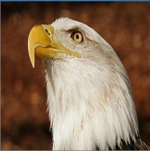
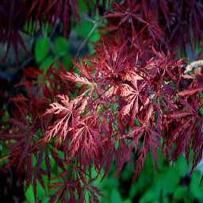
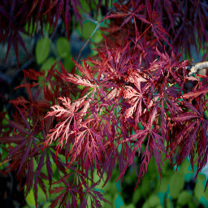
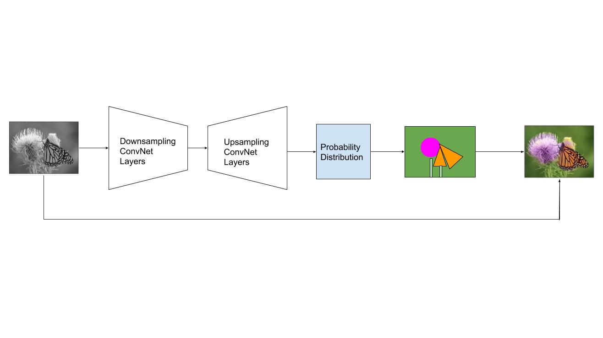
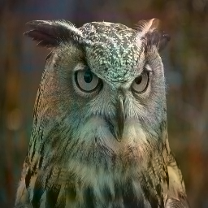
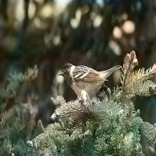
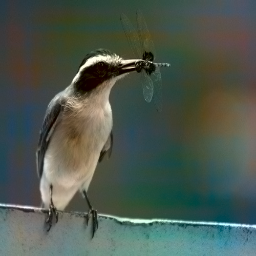
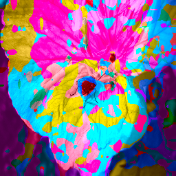
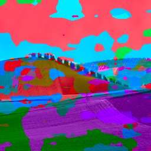
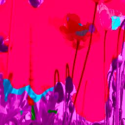

### Introduction/Background 

It has been long known technique to convert colored images into grayscale, but it is a much more challenging task to hallucinate[3] colors from greyscale images. In this project, we aim to leverage the power of machine learning to extract meaningful information out of the semantics[1][2] of the image to regenerate a plausible colorized image. Some of its potential application includes colorization of historical images that were captured in greyscale. 

### Problem Definition 

We will be working with images in the CIELAB color space, which means that we will take images with only the Lightness channel as input and generate the 2 missing channels (A and B color channels) based on semantic information in the images. Because an object can take on multiple colors in nature (e.g. an apple can be green, red, or yellow)[4], our goal is not to predict the original color pattern of the image. Instead, we want to generate a viable colorized image that looks realistic to the human eyes.  

### Data Collection

We used the MIR-FLICKR 25k dataset for training, evaluation and testing. As the first step of our preprocessing pipeline, we normalized image size by scaling them all to 256 x 256 images, and threw out images with either height or width less than 256. We then converted the images from RBG to the aforementioned CIELAB color space. When visualizing the images, we found that a portion of the dataset was already black and white, so we removed these images with ab(color) values that are lower than a certain threshold. Finally, we split our dataset into a training, evaluation and testing datasets with an 80/10/10 split. We did not do any special feature engineering because we are using image data with a convolutional neural network.

### Methods 

##### Unsupervised 
We used PCA to reduce dimensionality of the images and then feed it into our supervised learning method i.e. the Convolution Neural Network. We also used K-means to cluster the image into a finite number of color classes, so that we can use use a classification pipeline.

###### PCA
We performed PCA on the images to compress the images. We tried different values of retained variance and performed visual inspection on the images to see which was closest to the original. We found that 98% retained variance produces an image close to the orignal and had a size of 20% of the original. 

Original:  

Reduced:  

###### K-Means
We performed K-means to perform pixel-level clustering to create a generalized color pallete for our images. We tried different K values and found that training on 100 images with K=50 achieved a balance between result and training time. We converted a few new images into the clustered color space and found the result to be nearly indistinguishable from the original image.

Original:  

Clustered:  

##### Supervised

We first framed the problem as a regression problem over both the A and B space. Our model of choice is a fully convolutional network with a pretrained resnet-50 as the backbone. The network aims to extract semantic features through the downsampling part of the model and map these features back into color palletes in the upsampling part of the model. To train the network, we apply Regression loss using Mean Squared Error on the true colors of the image. 

Next, we tried to frame the problem as a multinomial classification with predefined AB color pairs for each pixel.  Our model of choice is also a Convolutional Neural Network[1][2][3][4] to extract semantic features and map it onto a per pixel probability distribution over all the AB pairs. We then chose the color of each pixel based on which color class has the highest probability.

### Results
As an outcome of this project, we aim to create realistic colorized pictures from gray scale images. To evaluate our results, we will use the metric of a Colorization Turing Test[3], where we will ask human subjects to identify the artificially generated color image from the ground truth image. This is the best evaluation for our goal of generating realistic people that can “fool” people into thinking that it’s real. Other metrics that we can use includes the MSE of the predicted images and the ground truth images. 

#### Regression
For regression, we trained only on bird images. After training 10 epochs on a training set of ~600 images with learning rate 5e-5 and batch size 16, we managed to obtain a training loss of 0.003. Attached are some of our results from the validation set:

#### Classification
For classification, we trained only on plant images. After running K-means, we took the 50 cluster centers as our 50 color classes. Then, we trained 50 epochs on a training set of ~1000 images with learning rate of 1e-4 and batch size 16, we ended up with a training loss of 1.113. Attached are some of our results from the validation set:

### Discussion
Due to the complex nature of the process of converting grayscale images to their full correct color image, our primary goal is to get some sort of semblance of the true color to the image, not necessarily the fully saturated version. 

With the regressional results, one thing we noticed was that many of them have a bluish hue. We hypothesize that this is caused by a majority of the training set having blue backgrounds. We tried to combat this by switching from a regressional model to a classification model. We hypothesized that using a different metric that accounts for skewed classes can potentially balance the colors. 

In order to use a classification model, we used k-means to cluster the colors into 50 classes. Although the results were really good, it was very computationaly expensive and the training time was very long as well. Another challenge that we faced was the limitation of computational resources. We relied the the free Google COLAB GPU to run our model. However, we reached the GPU usage limit when we tried to train our classification model, thus we couldn't train on more images or more epochs as we wished. We think the classfication model has the potential to produce better results than regression model if we had more computational resources to train it on.

<!--Another problem we are facing is the imbalance[3] between low saturated pixels (majority) and the high saturated pixels (rare) in images. This is causing the output to be dominated by low saturation pixels and therefore cause the output image to look dull and grey-ish. -->

### Conclusion
Based on our model and the computing resource limitations, using regression produced more successful results than using classification. We got good results from PCA, therefore in the future we would add the results from these in our training pipeline. Overall, image colorization is a feasible problem to solve using the deep learning approch combined with unsurpovised methods. 

### References 
1. Iizuka, S., Simo-Serra, E., & Ishikawa, H. (2016). Let there be color! ACM Transactions on Graphics, 35(4), 1-11. doi:10.1145/2897824.2925974 

2. Larsson, G., Maire, M., & Shakhnarovich, G. (2016). Learning Representations for Automatic Colorization. Computer Vision – ECCV 2016 Lecture Notes in Computer Science, 577-593. doi:10.1007/978-3-319-46493-0_35 

3. Zhang, R., Isola, P., & Efros, A. A. (2016). Colorful Image Colorization. Computer Vision – ECCV 2016 Lecture Notes in Computer Science, 649-666. doi:10.1007/978-3-319-46487-9_40 

4. Hwang, J. (2016). Image Colorization with Deep Convolutional Neural Networks. 

5. Link to dataset - http://press.liacs.nl/mirflickr/mirdownload.html
